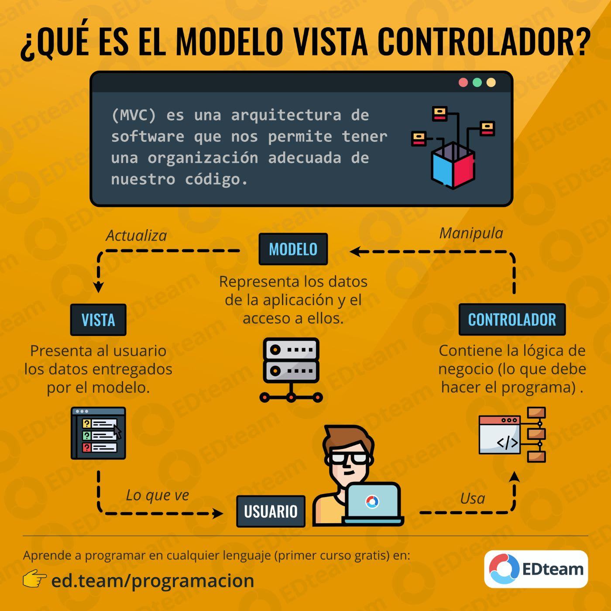

# Front-End Web

## Requerimientos

- Estructurar y modular nuestro código para emular la arquitectura `Modelo Vista Controlador`:

  

- Linting: `JavaScript Standard Style`
- Frameworks Diseño:
*react-icons
*react-bootstrap

##Colores
#34c759 -> verde
#48484a -> gris
#293a4b -> azul oscuro
#5856d6 -> azul claro
#007aff -> celeste
#ff9500 -> naranja